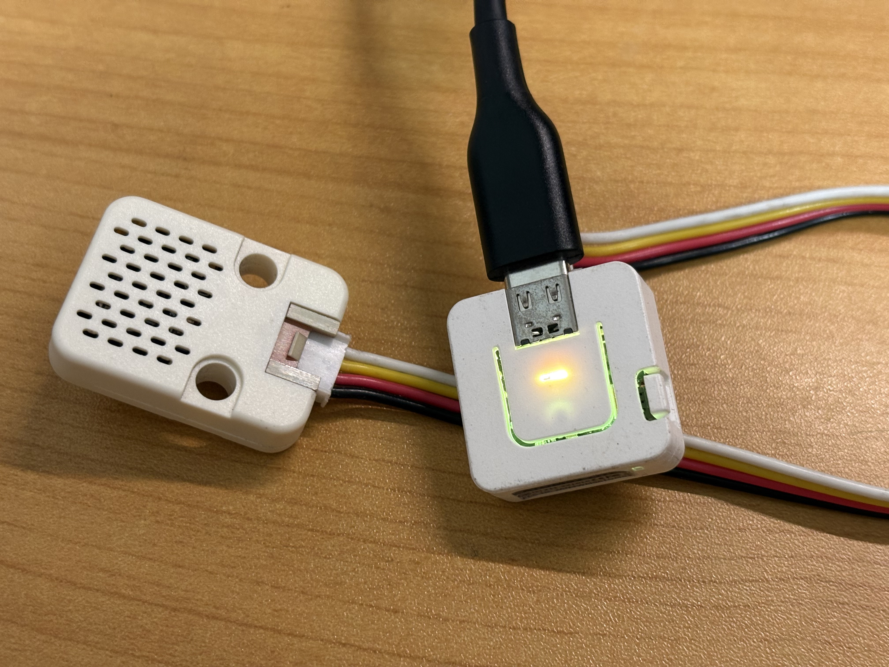
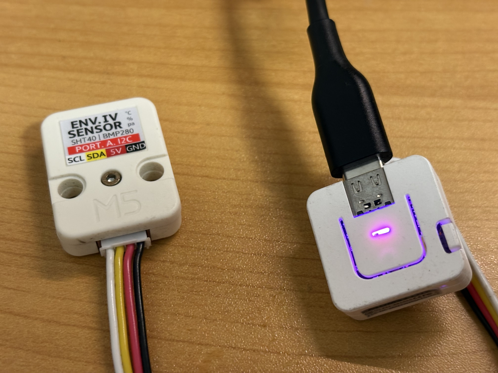

# AtomS3Lite Environmental Sensor

**言語:** 日本語 | [English](README.md)

[統合ハブ](https://github.com/omiya-bonsai/m5papers3-weather-learning-system)

M5 Atom S3 Lite を使った、**WiFi・NTP・MQTT対応**の環境センサープロジェクトです。  
温度・湿度・気圧を測定し、監視や記録に向いた**構造化JSON**として MQTT に publish します。

今回の改訂では、次を追加しています。

- **NTP時刻同期**
- MQTT payload に **Unix時刻 `ts`**
- **デバイスID `id`**
- **送信連番 `seq`**
- **稼働秒数 `uptime_s`**
- **時刻有効フラグ `time_valid`**
- **時刻が有効になるまで publish しない設計**

## デバイスの外観

<div style="display: flex; gap: 20px;">
  
  
</div>

## 機能

- **センサー計測**
  - SHT40（温度・湿度）
  - BMP280（気圧）

- **通信**
  - WiFi自動再接続
  - MQTT自動再接続
  - 起動時NTP同期
  - 定期NTP再同期
  - タイムアウト保護

- **構造化MQTT payload**
  - `id`: デバイス識別子
  - `ts`: Unix epoch 秒
  - `temperature`
  - `humidity`
  - `pressure`
  - `seq`: publish連番
  - `uptime_s`: 起動からの経過秒数
  - `time_valid`: 内部時計が有効かどうか

- **LEDヘルスインジケーター**（NeoPixel RGB）
  - 紫：起動中
  - 黄：WiFi / MQTT 接続中
  - 青：正常動作
  - 赤：エラー検出
  - 緑：MQTT publish 成功

- **堅牢性**
  - ウォッチドッグタイマー（WDT）
  - エラーハンドリング
  - センサー自動復帰
  - 24時間常時運用を意識した構成

## 必要なハードウェア

- **マイコンボード**
  - M5 Atom S3 Lite

- **センサー**
  - SHT40（I2C、アドレス `0x44`）
  - BMP280（I2C、アドレス `0x76`）

## 配線

| M5 Atom S3 Lite | SHT40 | BMP280 |
|----------------|-------|--------|
| 5V(5)          | VCC   | VCC    |
| GND(GND)       | GND   | GND    |
| G2(SDA)        | SDA   | SDA    |
| G1(SCL)        | SCL   | SCL    |

### I2Cアドレス

- SHT40: `0x44`
- BMP280: `0x76`

## セットアップ手順

### 1. Arduino IDE のセットアップ

#### 1.1 ボードマネージャURLの追加

1. Arduino IDE を開く
2. **Arduino IDE > Settings**（Mac）または **File > Preferences**（Windows）を開く
3. **Additional Boards Manager URLs** に次を追加する

   ```text
   https://dl.espressif.com/dl/package_esp32_index.json
   https://m5stack.oss-cn-shenzhen.aliyuncs.com/resource/arduino/package_m5stack_index.json
   ```

4. **OK** を押す

#### 1.2 ボードサポートのインストール

1. **Tools > Board > Boards Manager** を開く
2. `M5Stack` を検索
3. **M5Stack by M5Stack official** をインストールする（3.2.5以上推奨）
4. **Tools > Board** で **M5Stack AtomS3** を選ぶ

#### 1.3 推奨ボード設定

**Tools** で次を確認してください。

- **Board**: M5Stack AtomS3
- **Upload Speed**: 921600
- **USB Mode**: Hardware CDC and JTAG
- **CPU Frequency**: 240MHz
- **Flash Size**: 8MB
- **Partition Scheme**: Default 8MB

### 2. 必要ライブラリのインストール

**Sketch > Include Library > Manage Libraries** から次をインストールします。

| ライブラリ | 説明 |
|-----------|------|
| **M5AtomS3** | M5 Atom S3 Lite用コアライブラリ |
| **PubSubClient** | MQTTクライアント |
| **Sensirion I2C SHT4x** | SHT40ドライバ |
| **Adafruit BMP280** | BMP280ドライバ |
| **FastLED** | NeoPixel RGB LED制御 |

### 3. プロジェクト設定

#### 3.1 `config.h` を作成

まずテンプレートをコピーします。

```bash
cp config.example.h config.h
```

次に `config.h` を自分の環境に合わせて編集します。

例：

```cpp
// WiFi設定
const char *ssid = "YOUR_SSID";
const char *password = "YOUR_PASSWORD";

// デバイス識別
#define CONFIG_DEVICE_ID "env4"
#define CONFIG_MQTT_CLIENT_ID_PREFIX "AtomS3Lite-Env4-"

// MQTT設定
#define CONFIG_MQTT_SERVER "broker.local"
#define CONFIG_MQTT_PORT 1883
#define CONFIG_MQTT_TOPIC "env4"

// 時刻/NTP設定
#define CONFIG_TZ_INFO "JST-9"
#define CONFIG_NTP_SERVER_1 "ntp.nict.jp"
#define CONFIG_NTP_SERVER_2 "pool.ntp.org"
#define CONFIG_NTP_SERVER_3 "time.google.com"
```

### 4. ビルドとアップロード

1. **Sketch > Verify/Compile** でコンパイル確認
2. **Sketch > Upload** で書き込み
3. **Tools > Serial Monitor** を **115200 baud** で開く

## 動作概要

### 起動時の流れ

起動時には次の順で処理します。

1. LED、I2C、各センサー初期化
2. WiFi接続
3. MQTT設定
4. NTP時刻同期
5. センサー読取りとMQTT送信開始

### 時刻処理

MQTT payload には Unix 時刻を入れます。

- `ts` = Unix epoch 秒
- `time_valid` = 時刻が有効なら `1`、無効なら `0`

時刻が未同期のまま誤った時刻で送っても監視品質を下げるだけなので、  
このファームウェアでは**時刻が有効になるまで publish をスキップ**します。

### NTP同期方針

基本方針は次の通りです。

- 起動時に同期
- WiFi再接続後に再同期
- 24時間ごとに再同期

これは、

- 時刻精度
- ネットワーク負荷
- 消費電力

のバランスが良い実用的な設定です。

## シリアルモニタ出力例

### 起動時

```text
================================================================================
Device: M5 Atom S3 Lite
Firmware: AtomS3Lite Environmental Sensor v1.1.0
Built: Mar 22 2026 12:34:56
================================================================================

[INFO] System startup
[INFO] SHT40 sensor initialized
[INFO] BMP280 sensor initialized
[INFO] Connecting to WiFi
[INFO] WiFi connected
[INFO] Starting NTP sync
[INFO] NTP sync successful
[INFO] Local time: 2026-03-22 12:35:10
[INFO] Attempting MQTT connection
[INFO] MQTT connected
```

### センサー読取りと送信

```text
[TEMP] 25.50 °C
[HUM] 45.30 %
[PRES] 1013.25 hPa
[MQTT] {"id":"env4","ts":1774150510,"temperature":25.50,"humidity":45.30,"pressure":1013.25,"seq":12,"uptime_s":365,"time_valid":1}
[INFO] MQTT publish successful
```

## MQTT トピックと payload

### トピック

```text
env4
```

### payload 例

```json
{
  "id": "env4",
  "ts": 1774150510,
  "temperature": 25.50,
  "humidity": 45.30,
  "pressure": 1013.25,
  "seq": 12,
  "uptime_s": 365,
  "time_valid": 1
}
```

### 各フィールドの意味

| フィールド | 型 | 説明 |
|-----------|----|------|
| `id` | string | デバイス識別子 |
| `ts` | integer | Unix epoch 秒 |
| `temperature` | number | 温度（°C） |
| `humidity` | number | 相対湿度（%） |
| `pressure` | number | 気圧（hPa） |
| `seq` | integer | publish連番 |
| `uptime_s` | integer | 起動からの経過秒数 |
| `time_valid` | integer | 時刻が有効なら `1`、そうでなければ `0` |

## なぜ payload を増やしたのか

旧形式の payload は、値そのものを見るだけなら十分でした。  
しかし、監視・通知・障害解析まで考えると不十分です。

今回の改訂で、次が改善されます。

- **通知の精度**
  - いつ異常が起きたかを判断しやすい

- **ログの信頼性**
  - 測定時刻を正しく保存できる

- **デバッグ**
  - 再起動や publish 欠落を追いやすい

- **データ品質**
  - NTP未同期の壊れた時刻データを避けられる

## 監視確認例

MQTT の出力確認は次で行えます。

```bash
mosquitto_sub -h broker.local -t "env4" -v
```

出力例：

```text
env4 {"id":"env4","ts":1774150510,"temperature":25.50,"humidity":45.30,"pressure":1013.25,"seq":12,"uptime_s":365,"time_valid":1}
```

## トラブルシューティング

### ライブラリが見つからない

```text
fatal error: M5AtomS3.h: No such file or directory
```

**確認事項**

1. M5Stack ボードサポートが入っているか
2. **M5Stack AtomS3** が選択されているか
3. Arduino IDE を再起動したか

### WiFi接続失敗

```text
[WARN] WiFi connection failed
```

**確認事項**

- `config.h` の `ssid` と `password`
- 2.4GHz のWiFiを使っているか
- 電波状況が悪くないか

### MQTT接続失敗

```text
[WARN] MQTT connection timeout
```

**確認事項**

- `CONFIG_MQTT_SERVER`
- `CONFIG_MQTT_PORT`
- MQTTブローカーが起動しているか
- ファイアウォールやLAN分離設定

### センサーは読めているのに publish されない

原因候補：

- NTP同期がまだ成功していない
- `time_valid` が false のまま
- 時刻有効化まで publish を抑止している

シリアルモニタで次が出ていないか確認してください。

```text
[WARN] Time not valid yet, skipping publish
```

### `ts` が不正、またはゼロに近い

確認すべき点：

- WiFi接続
- NTPサーバ到達性
- `config.h` のNTP設定やタイムゾーン設定

### センサー認識失敗

```text
[WARN] BMP280 sensor initialization failed
```

**確認事項**

- I2C配線
- 電源/GND
- I2Cアドレス
- 実際のモジュールが BMP280 かどうか  
  （BME280 など別物を誤認しているケースは珍しくありません）

### I2Cアドレス確認

次のスニペットで I2C スキャンできます。

```cpp
Wire.begin(2, 1, 100000);
for (int addr = 1; addr < 127; addr++) {
  Wire.beginTransmission(addr);
  if (Wire.endTransmission() == 0) {
    Serial.print("Found at 0x");
    Serial.println(addr, HEX);
  }
}
```

## ファイル構成

```text
atomS3Lite_w_env4/
├── README.md
├── README-ja.md
├── config.example.h
├── config.h
├── atomS3Lite_w_env4.ino
└── .gitignore
```

## 主な設定項目

| 項目 | デフォルト | 説明 |
|------|-----------|------|
| `CONFIG_DEVICE_ID` | `env4` | payloadに含めるデバイスID |
| `CONFIG_MQTT_SERVER` | `broker.local` | MQTTブローカー |
| `CONFIG_MQTT_PORT` | `1883` | MQTTポート |
| `CONFIG_MQTT_TOPIC` | `env4` | publish先トピック |
| `CONFIG_PUBLISH_INTERVAL` | `30000` | publish間隔（ms） |
| `CONFIG_WIFI_TIMEOUT` | `30000` | WiFi接続タイムアウト（ms） |
| `CONFIG_WIFI_RECONNECT_INTERVAL` | `10000` | WiFi再接続間隔（ms） |
| `CONFIG_MQTT_TIMEOUT` | `10000` | MQTT接続タイムアウト（ms） |
| `CONFIG_SENSOR_REINIT_INTERVAL` | `300000` | センサー再初期化間隔（ms） |
| `CONFIG_NTP_SYNC_TIMEOUT_MS` | `15000` | NTP同期タイムアウト（ms） |
| `CONFIG_NTP_RESYNC_INTERVAL_MS` | `86400000` | NTP再同期間隔（ms） |
| `CONFIG_JSON_PAYLOAD_SIZE` | `192` | MQTT payloadバッファサイズ |

## 補足

- `ts` は Unix epoch 秒です。
- `seq` は publish 成功ごとに増加します。
- `uptime_s` は `millis()` ベースです。
- `time_valid=1` は内部時計が妥当域に入ったことを示します。

## ライセンス

- プロジェクトライセンス: [MIT](./LICENSE)

## 著者

omiya-bonsai

## 参考資料

- [M5AtomS3 公式ドキュメント](https://docs.m5stack.com/en/core/AtomS3)
- [Arduino ESP32 環境構築](https://docs.espressif.com/projects/arduino-esp32/en/latest/installing.html)
- [PubSubClient ドキュメント](https://pubsubclient.knolleary.net/)
